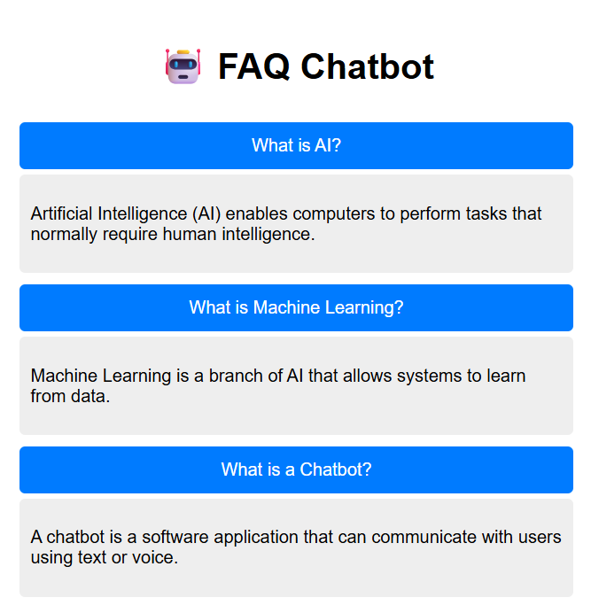

# 🤖 CodeAlpha FAQ Chatbot

An interactive and responsive FAQ Chatbot developed as part of the **CodeAlpha Web Development Internship**. This project provides users with quick answers to frequently asked questions through a clean and user-friendly interface.

## 🚀 Live Features

- 💬 Interactive FAQ chatbot interface
- 📱 Responsive design for desktop and mobile
- ⚡ Fast and lightweight
- 🎨 Clean and modern UI
- 🖱️ Easy navigation and user-friendly experience

## 🛠️ Built With

- HTML5
- CSS3
- JavaScript (ES6)

## 📂 Project Structure

```
CodeAlpha_FAQ_Chatbot/
│── index.html
│── style.css
│── script.js
└── README.md
```

## ▶️ How to Run

1. Download or clone this repository.
2. Open the project folder.
3. Open `index.html` in your browser.
4. Start interacting with the FAQ Chatbot.

## 📸 Preview



## 🎯 Internship Task

This project was created as part of the **CodeAlpha Web Development Internship Program**.

## 👨‍💻 Author

**Bijaya Kumar Jena**

- 🎓 B.Tech (Computer Science & Engineering)
- 🏫 Centurion University of Technology and Management
- 🌐 GitHub: https://github.com/bijayakumar2409-hue

---

⭐ If you like this project, don't forget to give it a Star on GitHub!